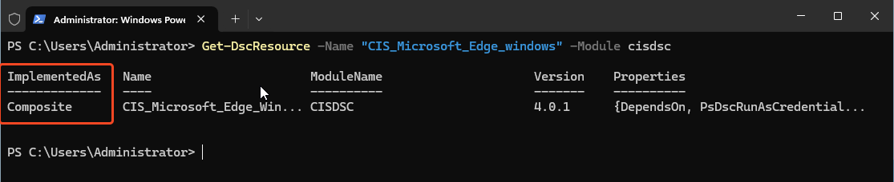

# Using PowerShell DSC resources with Ansible

## What is DSC?
PowerShell DSC (Desired State Configuration) is a PowerShell native configuration management framework. Ansible has support to directly leverage this communities body of work via playbooks.There is a fair degree of overlap between the official Microsoft resources and Ansible.Windows but there are some notable community modules available that are very useful.

1) The [DSC Community](https://github.com/dsccommunity) maintains several modules for: SQLServer, IIS, Sharepoint, ActiveDirectory, Secuirty/Audit policies, etc.

2) Microsoft also maintains [modules for O365](https://github.com/Microsoft/Microsoft365DSC)

## Prerequisites
1) Windows PowerShell 5.1 is installed on the node. (Default in Server 2016+)
2) There is no other source of DSC configuartion (Azure Automation or pull server)
3) Ensure the resource you intend to use is not a "composite" as these are not supported. This can be verified by running the following on a Windows machine and checking the "ImplementedAs" value returned.
```powershell
$ModuleName = "Module Name"
$ResourceName = "Resource Name"
Install-Module -Name $ModuleName
Import-Module -Name $ModuleName
Get-DscResource -Name $ModuleName -Module $ModuleName
```

